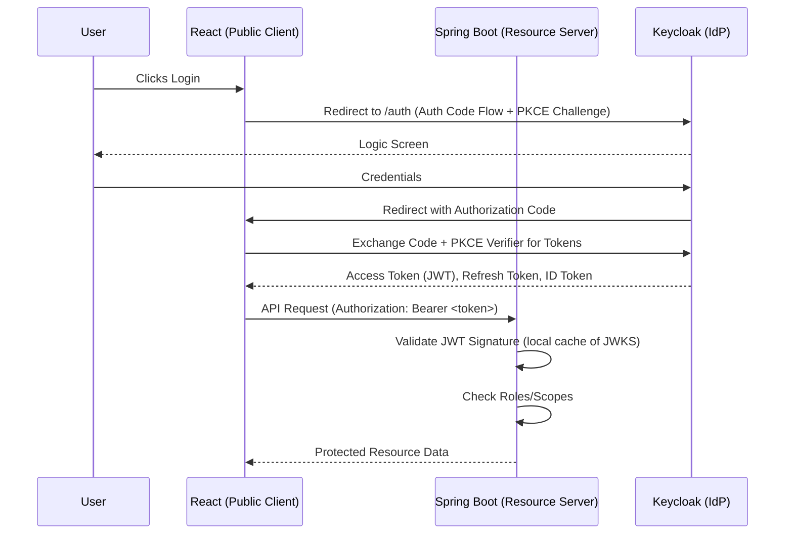

# Keycloak Implementation Guide: Spring Boot & React

## 1. Executive Summary

This document outlines the technical architecture and implementation strategy for integrating Keycloak 26+ (Quarkus-based) with a **Spring Boot 3.x** backend and a **React 18+** frontend.

The architectural pattern selected is **OpenID Connect (OIDC)** using the **Authorization Code Flow with PKCE (Proof Key for Code Exchange)**. This is the current current best practice for Single Page Applications (SPAs) accessing REST APIs, ensuring tokens are not exposed in URLs and mitigating interception attacks.

### Context
- **Shared Infrastructure**: Single Keycloak instance accommodating multiple applications.
- **Logical Isolation**: Implementation of a dedicated **Realm** for this application to ensure complete separation of users, roles, and client configurations from other apps on the same instance.

---

## 2. Architecture Overview

### High-Level Flow
1.  **User Identity**: Managed centrally by Keycloak.
2.  **Frontend (Public Client)**: Initiates login, handles redirects, exchanges code for tokens (Access, ID, Refresh) using PKCE. Stores tokens in memory (recommended) or secure storage.
3.  **Backend (Resource Server)**: Stateless. Validates Access Tokens (JWT) via Keycloak's JWK Set (JSON Web Key Set) or Issuer signature. Enforces Role-Based Access Control (RBAC).



---

## 3. Keycloak Configuration (Identity Provider)

Since we are sharing a Keycloak instance, strict realm isolation is required.

### 3.1. Realm Setup
Create a new Realm (e.g., `meettime-realm`). Access to the master realm should be restricted to infrastructure admins.

### 3.2. Client Configuration
We require two logical client definitions, though often one "Frontend" client covers both if the backend is just checking signatures. However, for clarity and potential backend-to-backend needs:

#### A. Frontend Client (SPA)
*   **Client ID**: `meettime-web`
*   **Client Protocol**: OpenID Connect
*   **Client Authentication**: `On` (if using client secret - **avoid for SPAs**) or `Off` (Public) -> **Select Public Access** (or "Client authentication" off in newer UIs).
*   **Authentication Flow**: Standard Flow (Auth Code). **PKCE** must be enabled (usually default in recent versions, or enforceable via "Advanced Settings" -> "Proof Key for Code Exchange Code Challenge Method": `S256`).
*   **Valid Redirect URIs**: `https://app.meettime.com/*`, `http://localhost:5173/*` (Strict matching required).
*   **Web Origins (CORS)**: `+` or specific domains.

#### B. Backend Resource Server (Optional explicit definition)
Spring Boot 3 (Resource Server) usually usually validates tokens issued for the frontend client (audience verification). If the backend needs to trigger actions or talk to Keycloak directly (e.g., admin API), create a **Confidential** client (`meettime-backend`).
*   **Access Type**: Bearer-only (Historical) or Confidential.
*   Note: Modern Spring Security validates based on `iss` (Issuer) and `aud` (Audience). If `aud` matches `meettime-web`, the backend accepts it.

### 3.3. Roles & Attributes
*   **Realm Roles**: Global application roles (e.g., `ROLE_USER`, `ROLE_ADMIN`).
*   **Client Scopes**: Ensure a custom scope or the default `microprofile-jwt` scope is applied so that roles are mapped into the token correctly (e.g., under `realm_access.roles` or `resource_access`).

---

## 4. Spring Boot Backend Implementation

The backend acts purely as an OAuth2 **Resource Server**. It does not handle login forms or redirects.

### 4.1. Dependencies
Use `spring-boot-starter-oauth2-resource-server`.
Do **not** use `keycloak-spring-boot-starter` (deprecated/maintenance mode). Use standard Spring Security 6.

### 4.2. Configuration (`application.yml`)
Point the resource server to the Keycloak Realm issuer. Spring Boot uses this to discover the JWK Set URI configurations automatically (`.well-known/openid-configuration`).

```yaml
spring:
  security:
    oauth2:
      resourceserver:
        jwt:
          issuer-uri: https://auth.yourdomain.com/realms/meettime-realm
          # Optional: Enforce audience
          # audiences: meettime-web
```

### 4.3. Security Configuration (`SecurityConfig.java`)
Keycloak puts roles in a nested JSON path (`realm_access.roles` or `resource_access.{client}.roles`). Spring Security expects authorities in a flat list (usually `SCOPE_...` or `ROLE_...`).

**Critical Implementation Detail**: You must implement a custom `JwtAuthenticationConverter`.

1.  **Extract Roles**: Parse the JWT claims to find the roles list.
2.  **Map to Authorities**: Prefix with `ROLE_` and return as `SimpleGrantedAuthority`.
3.  **Security Filter Chain**:
    ```java
    @Bean
    public SecurityFilterChain filterChain(HttpSecurity http) throws Exception {
        http
            .csrf(csrf -> csrf.disable()) // Stateless APIs don't need CSRF (usually)
            .cors(Customizer.withDefaults())
            .authorizeHttpRequests(auth -> auth
                .requestMatchers("/api/public/**").permitAll()
                .requestMatchers("/api/admin/**").hasRole("ADMIN")
                .anyRequest().authenticated()
            )
            .oauth2ResourceServer(oauth2 -> oauth2
                .jwt(jwt -> jwt.jwtAuthenticationConverter(myCustomJwtConverter()))
            );
        return http.build();
    }
    ```

---

## 5. React Frontend Implementation

The frontend is responsible for the user session lifecycle.

### 5.1. Library Selection
Recommend **`react-oidc-context`** (a wrapper around the certified `oidc-client-ts`) or the official **`keycloak-js`** adapter.
*   `react-oidc-context`: More generic, strictly OIDC compliant, easier to swap providers later.
*   `keycloak-js`: Native Keycloak features (easier access to explicit Keycloak functions like registration URL, account management URL).

**Recommendation**: Use `react-oidc-context` for pure React adherence, or `keycloak-js` if you heavily rely on Keycloak-specific features (like checking "resource_access" permissions easily).

### 5.2. Integration Steps
1.  **Auth Provider**: Wrap the main `App` component with `<AuthProvider>` (oidc) or `<ReactKeycloakProvider>`.
    *   Config: `authority` (Realm URL), `client_id`, `redirect_uri`, `response_type: 'code'`, `scope: 'openid profile email'`.
2.  **Login Strategy**:
    *   **Automatic**: Redirect to login immediately if not authenticated (common for enterprise apps).
    *   **On-Demand**: "Login" button triggers `auth.signinRedirect()`.
3.  **Token Management**:
    *   **Storage**: Libraries typically default to `sessionStorage` or `localStorage`. `sessionStorage` is preferred to clear on tab close.
    *   **Refresh**: enable `automaticSilentRenew`. This uses a hidden iframe or Fetch request to get a new Access Token before the old one expires using the Refresh Token.

### 5.3. Tracking Constraints
To effectively handle backend requests:
*   **Axios Interceptor**: Create a global HTTP client. Add an interceptor that checks if the user is logged in and attaches `Authorization: Bearer ${token}` to every request header.
*   **Handling 401s**: If the backend returns 401 (Unauthorized), the interceptor should trigger a token refresh or force a logout/redirect to login.

---

## 6. Development & DevOps Considerations

### 6.1. Local Development (Docker Compose)
*   Container 1: `keycloak` (Postgres backed). Import a `realm-export.json` on startup to pre-configure the local realm/client for developers.
*   Container 2: `postgres` (for Keycloak).
*   Container 3: `backend` (Spring).
*   Container 4: `frontend` (Vite/React).

### 6.2. Discovery & Connectivity
*   **Browser (Frontend)**: Must access Keycloak via a public URL (e.g., `http://localhost:8080` or `https://auth.dev.local`).
*   **Backend (Docker)**: Must access Keycloak to fetch JWKS.
    *   *Challenge*: Docker networking. If Keycloak is `http://keycloak:8080` inside Docker, but Frontend sees `http://localhost:8080`, the JWT `issuer` claim will mismatch.
    *   *Solution*:
        1.  Use a host alias / DNS so both host machine and docker container resolve `auth.local` to the same place.
        2.  Or configurate Spring Boot `issuer-uri` to the internal Docker URL, but use a separate configuration for JWT validation to accept the external issuer URL (via `JwkSetUri` property manual override).

### 6.3. Production Settings
*   **HTTPS is mandatory**. PKCE and OIDC flows require secure contexts.
*   **Clustering**: For high availability, Keycloak requires a distributed cache (Infinispan) set up.
*   **Database**: Keycloak is database-heavy. Ensure the Postgres instance for Keycloak is tuned.

## 7. Migration Interaction (Specific to your Request)
Since you are adding this app to an existing instance with a different realm:
1.  **No Code Collision**: The apps are totally independent.
2.  **Configuration Collision**: Ensure port mappings don't conflict if running locally.
3.  **Shared Resources**: If both apps are very similar, you can extract the "Keycloak JWT Converter" logic in Spring Boot into a shared internal library to reuse the Role extraction logic.

